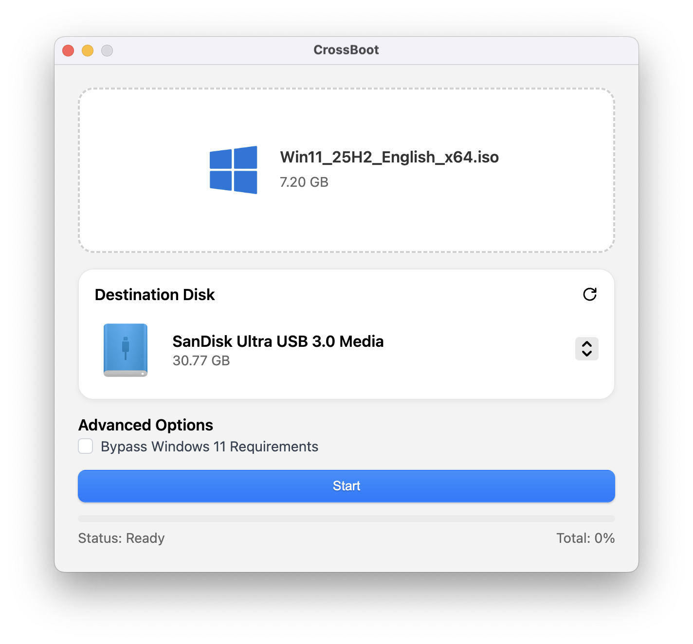

# CrossBoot

A simple tool for creating Windows bootable USB drives on macOS.



## Features

- Clean and easy-to-use interface
- Automatic WIM file splitting for FAT32 compatibility (handles files over 4GB)
- Supports both Legacy BIOS and UEFI boot modes
- Secure Boot compatible
- Drag-and-drop ISO support
- Real-time progress tracking
- Option to bypass Windows 11 hardware requirements

## Requirements

- macOS (Apple Silicon only)
- Administrator privileges (required for disk operations)
- Windows ISO file
- USB drive (8GB or larger recommended)

## Installation

Download the latest release from the releases page and install the application.

## Usage

1. Insert your USB drive
2. Select the target USB drive from the dropdown
3. Choose your Windows ISO file (click to browse or drag-and-drop)
4. Optional: Enable "Bypass Windows 11 Requirements" if needed
5. Click "Create Bootable USB" and confirm
6. Wait for the process to complete

The tool will automatically format your USB drive to FAT32 and copy all necessary files. Large WIM files will be split automatically to ensure compatibility.

## Development

### Prerequisites

- Node.js (v18 or higher)
- npm or yarn

### Setup

```bash
# Install dependencies
npm install

# Run in development mode
npm start

# Build for production
npm run build

# Package the application
npm package
```

### Tech Stack

- Electron - Desktop application framework
- React - UI library
- Vite - Build tool and development server
- SCSS - Styling
- wimlib - WIM file manipulation

### Project Structure

```
src/
  components/     - React components
  styles/        - SCSS stylesheets
  assets/        - Images and icons
electron/
  main.js        - Electron main process
  preload.js     - Preload script for IPC
  wimlib/        - wimlib-imagex binary
```

## Acknowledgments

This project uses [wimlib](https://wimlib.net/) for WIM file operations. Special thanks to the wimlib developers for their excellent tool.

## License

See LICENSE file for details.
