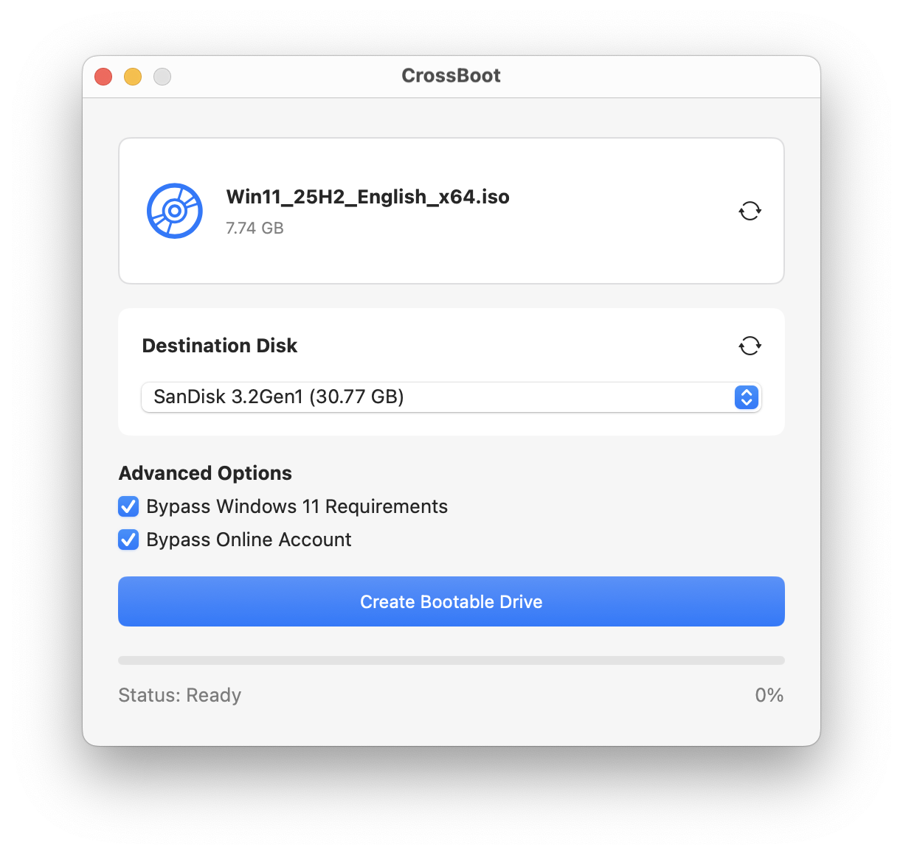

# CrossBoot

A simple tool for creating Windows bootable USB drives on macOS.

## Features

- Clean, user-friendly interface
- Combine several Windows versions on one drive, still bootable with Secure Boot on
- Auto-split WIM files for FAT32 compatibility (supports >4GB files)
- Supports both Legacy BIOS and UEFI boot modes
- Secure Boot ready
- Drag-and-drop ISO support
- Real-time progress tracking
- Cancelable operations
- Prevents system sleep during processing
- Bypass Windows 11 restrictions (TPM, Secure Boot, & Online Account)

## Requirements

- macOS 13 or later
- Mac Apple Silicon or Intel
- Windows ISO file
- USB drive (8GB or larger recommended)

## Installation

Download the latest release from the releases page and install the application.

**Note:** This app is not signed with an Apple Developer certificate. When running it for the first time, macOS Gatekeeper will block it. You'll need to allow the app in **System Settings > Privacy & Security** before you can run it.

## Usage

1. Insert your USB drive
2. Add one or more Windows ISO files (click "Add ISO…" or drag-and-drop)
3. Select the target USB drive from the dropdown
4. Optional: Enable "Bypass Windows 11 Requirements" if needed
5. Click "Create Bootable Drive" and confirm
6. Wait for the process to complete

The tool will automatically format your USB drive to FAT32 and copy all necessary files. Large WIM files will be split automatically to ensure compatibility.

### Multi-version drives

Add more than one ISO and CrossBoot builds a single drive that offers all of them. Windows Setup lists every
edition it found, labelled with its build number, and you pick one at install time.

The drive stays Secure Boot compatible because the boot chain is never rebuilt. The newest ISO supplies every
boot binary - `bootmgfw.efi`, `boot.wim` and setup - copied byte for byte, so firmware sees the same Microsoft
signatures as on single-version media. Only `sources/install.wim` is rewritten, and Windows Setup reads that as
data long after the firmware has handed over. There is no shim to install and no key to enroll.

Two limits follow from how Windows Setup works:

- **One architecture per drive.** x64 and ARM64 firmware each load their own boot loader, and both loaders can sit
  on one drive. What they cannot share is what comes next: a single `\sources\boot.wim` and a single BCD, both at
  fixed paths. Separating them means authoring a new BCD, which is a Windows registry hive, so CrossBoot refuses
  the combination when you add the second ISO rather than after erasing the drive.
- **The newest Windows supplies setup.** Its setup can deploy older images; an older setup cannot deploy newer
  ones. CrossBoot picks the base ISO for you.

Merging rewrites the install image on your Mac before anything reaches the drive, so it needs free scratch space
of roughly twice the combined size of the source install images. CrossBoot checks for it up front and stops
without erasing anything if the space is not there.

## Development

### Tech Stack

- Swift - Programming language
- SwiftUI - UI framework
- wimlib - WIM file manipulation

## Acknowledgments

This project uses [wimlib](https://wimlib.net/) for WIM file operations. Special thanks to the wimlib developers for their excellent tool.

## License

See LICENSE file for details.
