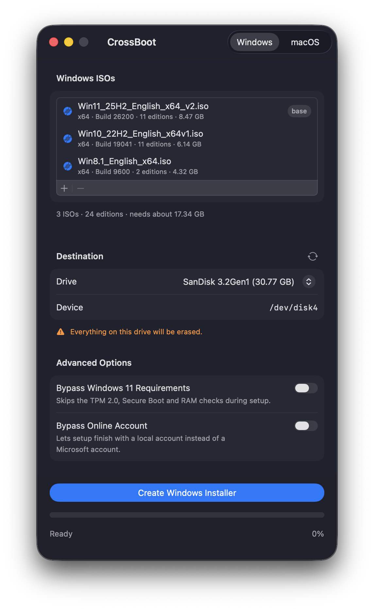
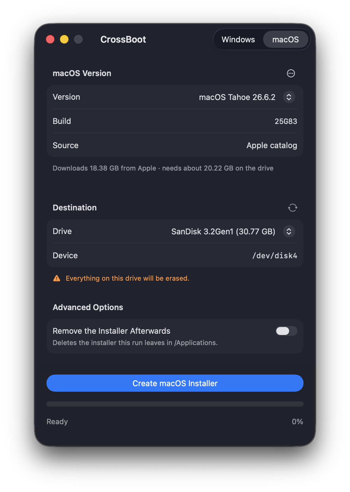

# CrossBoot

A simple tool for creating Windows and macOS bootable USB drives on macOS.

| Windows | macOS |
| --- | --- |
|  |  |

## Features

- Clean, user-friendly interface
- Create macOS install media for any release Apple still publishes, older or newer than this Mac
- Combine several Windows versions on one drive
- Auto-split WIM files for FAT32 compatibility (supports >4GB files)
- Supports both Legacy BIOS and UEFI boot modes
- Secure Boot ready
- Drag-and-drop ISO and macOS installer support
- Bypass Windows 11 requirements (TPM 2.0, Secure Boot and RAM checks)
- Bypass the Microsoft account requirement and finish setup with a local account

## Requirements

- macOS 13 or later (For macOS 11-12, use [v2.0.3](https://github.com/jschomchoey/CrossBoot/releases/tag/v2.0.3) )
- Mac Apple Silicon or Intel
- A Windows ISO file, or an internet connection for macOS media
- USB drive - 8 GB or larger for Windows, 32 GB or larger for macOS

## Installation

Download the latest release from the releases page and install the application.

**Note:** This app is not signed with an Apple Developer certificate. When running it for the first time, macOS Gatekeeper will block it. You'll need to allow the app in **System Settings > Privacy & Security** before you can run it. For creating macOS Installer, you need to give Full Disk Access permission.

## Usage

Pick **Windows** or **macOS** in the toolbar, choose the USB drive under **Destination**, then press the Create
button and confirm the erase. A run can be stopped while it works.

**Windows** - drop one or more ISO files on the window, or add them with **+**. Advanced Options skip the
Windows 11 requirement checks and the Microsoft account. The drive is formatted FAT32, and WIM files too large
for it are split automatically. Add several ISOs and the drive offers all of them at install time; they must
share one architecture, and the newest one supplies the boot files, so Secure Boot keeps working. Merging is
done on your Mac first and needs free space of about twice the combined install images - the drive is erased
only once it succeeds.

**macOS** - pick a release under **macOS Version** and enter your administrator password when asked. The list
comes from Apple's catalog rather than `softwareupdate`, so it is not limited to what this Mac is offered;
releases it cannot build are hidden until you ask for them in the **…** menu, which also adds an installer you
already have. Making the drive bootable needs Full Disk Access - switch **CrossBoot** on under
**System Settings > Privacy & Security > Full Disk Access** and reopen it. The password goes to `sudo` and
nowhere else, and a run leaves `Install macOS X.app` in `/Applications` unless Advanced Options removes it.

## Development

- Swift and SwiftUI
- [wimlib](https://wimlib.net/) - WIM file manipulation
- `createinstallmedia` - Apple's own tool, used unchanged for macOS media

## Acknowledgments

- [wimlib](https://wimlib.net/) by Eric Biggers - splitting and merging WIM images. CrossBoot bundles
  `wimlib-imagex` 1.14.5, built from the official source release without modification.
- Apple's `createinstallmedia`, `diskutil` and `softwareupdate`, used as they ship.

## License

CrossBoot is released under the MIT License - see the LICENSE file.

The bundled `wimlib-imagex` is a separate work by Eric Biggers, licensed under the
[GNU GPL v3 or later](https://gnu.org/licenses/gpl.html). It is built without modification from
[wimlib-1.14.5.tar.gz](https://wimlib.net/downloads/wimlib-1.14.5.tar.gz), which is the corresponding source
for the binary in the app bundle.
